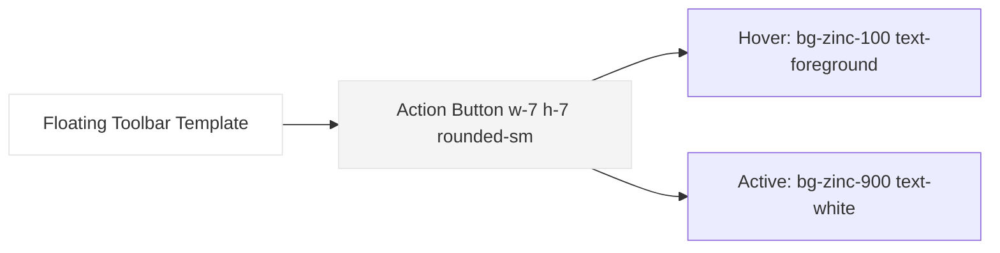

# 🎨 Hệ Thống Quy Chuẩn Thiết Kế Giao Diện (UI/UX Design System Specification) - Mindlabs

Tài liệu này quy định các tiêu chuẩn đồng bộ về thẩm mỹ, thông số kỹ thuật, cấu trúc thành phần (Component Hierarchy), và hướng dẫn kế thừa thiết kế cho toàn bộ hệ sinh thái **Mindlabs**. Quy chuẩn này giúp các nhà phát triển ở các dự án tương lai dễ dàng kế thừa, tái sử dụng các mẫu thiết kế và đảm bảo trải nghiệm **Premium Minimalist** đồng nhất.

---

## 📐 1. Quy Chuẩn Góc Bo (Border Radius System)

Để tối ưu hóa sự tối giản và tính nhất quán tuyệt đối, Mindlabs sử dụng hệ thống góc bo tinh giản chỉ gồm **2 cấp độ bo góc** duy nhất:

| Cấp độ | Giá trị Pixel | Giá trị `rem` | Tailwind Class | Trường hợp áp dụng cụ thể |
| :--- | :--- | :--- | :--- | :--- |
| **Mặc định (Default)** | `8px` | **`0.5rem`** | `rounded` / `rounded-default` / `rounded-md` / `rounded-lg` / `rounded-xl` | **Quy chuẩn chung**: Các thẻ Bento lớn, Main Cards, Modal, Sidebar, Note Editor, Ô nhập liệu (Inputs), Nút bấm tiêu chuẩn. |
| **Tròn (Pill)** | `9999px` | **`9999px`** | `rounded-full` | Nút nổi tròn nhỏ, thanh gạt Switch, nhãn đếm số (Counter Badges), avatar tròn. |

> [!TIP]
> **Đồng bộ hóa tự động**: Toàn bộ các class bo góc của Tailwind v4 (từ `xs` đến `3xl`) đều đã được ghi đè (override) về giá trị `8px` trong tệp [globals.css](file:///d:/mindlabs-driverbase/src/app/globals.css). Do đó, nhà phát triển có thể viết bất kỳ class `rounded` nào ngoài `rounded-full` và hệ thống sẽ tự động hiển thị ở mức bo góc chuẩn `8px`.

## 🌈 2. Hệ Thống Màu Sắc & Tương Phản (Color & Contrast System)

Mọi màu sắc sử dụng trong Mindlabs đều tuân thủ nghiêm ngặt tiêu chuẩn tương phản **WCAG 2.1 AA** (tỷ lệ tối thiểu **4.5:1** đối với văn bản thường, **3:1** đối với icon/đường viền quan trọng) để đảm bảo độ rõ ràng và tinh tế cao nhất trên cả giao diện Sáng (Light) và Tối (Dark).

### A. Màu Sắc Giao Diện Cốt Lõi (Zinc & Linear Indigo Palette)

*   **Primary (Màu nhấn thương hiệu)**: Tím Indigo `#5e6ad2` — Lấy cảm hứng từ Linear, sử dụng cho nút hành động chính, trạng thái active hoặc các tiêu điểm quan trọng cần thu hút sự chú ý.
*   **Background (Nền canvas)**:
    *   *Light Mode*: Màu trắng tinh khiết `#ffffff` làm canvas nền chính.
    *   *Dark Mode*: Màu đen mờ matte cao cấp `#08080a` hoặc `#09090b`.
*   **Surface (Nền container/panel)**:
    *   *Light Mode*: Xám nhạt `#f4f4f5` (Zinc 100) cho Sidebar và panel điều khiển phụ.
    *   *Dark Mode*: Xám đậm `#121214` hoặc `#161619` cho Sidebar, Container nổi.
*   **Border (Đường kẻ viền)**: 1px cực kỳ mảnh và mờ:
    *   *Light Mode*: `#e4e4e7` (Zinc 200) hoặc `#f1f5f9` (Slate 100).
    *   *Dark Mode*: `#27272a` (Zinc 800) hoặc `#1f1f23`.
*   **Border Strong (Viền tập trung)**:
    *   *Light Mode*: `#a1a1aa` (Zinc 400) cho hover hoặc focus.
    *   *Dark Mode*: `#3f3f46` (Zinc 700) cho hover hoặc focus.
*   **Secondary (Chữ phụ & Icon)**: `#71717a` (Zinc 500) — Dành cho đoạn mô tả, menu chưa active, tiêu đề phụ.

### B. Chiều Sâu & Bóng Đổ (Subtle Shadows & Modern Tactility Policy)

Mindlabs áp dụng chính sách đổ bóng siêu mỏng và mịn màng của Linear để tạo ra cảm giác vật lý tinh tế và phân lớp rõ ràng giữa các thành phần giao diện:

*   **Bóng đổ nút bấm & Ô nhập liệu (Tactile Shadow)**: Sử dụng lớp bóng đổ siêu mỏng `.shadow-subtle` (`box-shadow: 0 1px 2px rgba(0, 0, 0, 0.05);` hoặc `shadow-xs`) để nút bấm và input trông có vẻ nổi nhẹ trên bề mặt canvas, kích thích người dùng click.
*   **Bóng đổ thanh nổi & Sidebar (Floating Shadow)**: Sử dụng lớp bóng đổ lan tỏa rộng mờ `.shadow-floating` (`box-shadow: 0 8px 30px rgba(0, 0, 0, 0.03);` hoặc `shadow-sm`) cho Floating Toolbars, Sidebar, Cards để tạo ranh giới lớp mượt mà.
*   **Bóng đổ Modal & Popover (Overlay Shadow)**: Sử dụng lớp bóng sâu nhưng nhẹ nhàng (`box-shadow: 0 12px 40px rgba(0, 0, 0, 0.08);`) để phân tách hoàn toàn lớp trên cùng với nền phía dưới.

### C. Màu Sắc Trạng Thái Tối Giản (Semantic Muted Statuses)

Để tránh ô nhiễm thị giác bởi các mảng màu rực rỡ lớn, Mindlabs áp dụng quy chuẩn chấm trạng thái tối giản (Status Dot):

*   **Thành công (Success)**: Sử dụng chấm tròn nhỏ màu xanh lá cây `bg-green-500` kết hợp văn bản Zinc thông thường.
*   **Cảnh báo (Warning)**: Sử dụng chấm tròn màu vàng cam `bg-amber-500` kết hợp văn bản Zinc.
*   **Thất bại/Lỗi (Error)**: Sử dụng chấm tròn màu đỏ `bg-red-500` kết hợp văn bản Zinc.

---

## ⚡ 3. Nguyên Tắc Đồng Bộ Thành Phần Tương Đồng (Component Synchronization)

Các thành phần có chức năng, cách hoạt động tương đồng nhau (như **Thanh công cụ định dạng chữ** và **Thanh công cụ điều khiển Node trên Canvas**) phải được xây dựng từ một khuôn mẫu duy nhất để tạo trải nghiệm đồng bộ.



### A. Quy chuẩn Bảng Điều Khiển Nổi (Floating Control Toolbar)
Áp dụng cho: *Text formatting bar (Rich Editor)* và *Canvas Node Action Bar (Mindmap Tool)*.

1.  **Cấu trúc Container**:
    *   Sử dụng lớp nền kính mờ: `bg-white/80 dark:bg-zinc-900/80 backdrop-blur-md`
    *   Đường viền: `border border-border-main`
    *   **Bóng đổ**: Phẳng nhẹ với bóng chìm siêu mỏng `.shadow-subtle`.
    *   Góc bo tiêu chuẩn: `rounded-md` (`6px`) hoặc `rounded-lg` (`8px`).
    *   Khoảng cách đệm: `px-2.5 py-1 flex items-center gap-0.5`
2.  **Cấu trúc Nút chức năng (Toolbar Button)**:
    *   Kích thước gọn gàng: `w-7 h-7 rounded-sm flex items-center justify-center`
    *   Màu sắc icon mặc định: `text-secondary` (`Zinc 500`)
    *   **Trạng thái Hover**: `hover:bg-zinc-100 dark:hover:bg-zinc-800 hover:text-foreground transition-all duration-150`
    *   **Trạng thái Active (Đang bật)**: `bg-zinc-900 dark:bg-zinc-100 text-white dark:text-zinc-900 font-semibold`
    *   **Trạng thái Disabled (Không khả dụng)**: `opacity-30 cursor-not-allowed`
3.  **Vách ngăn giữa các cụm nút**:
    *   Sử dụng thẻ `div` hoặc `span` có class `w-[1px] h-3.5 bg-border-main mx-1` để phân tách logic rõ ràng.

### B. Quy chuẩn các Node Tương Tác trên Canvas (Canvas Interactive Nodes)
Áp dụng cho: *TextNode*, *NoteNode* trên bảng mindmap.

1.  **Cấu trúc bọc ngoài (Wrapper)**:
    *   Nền: `bg-white dark:bg-zinc-950`
    *   Góc bo: `rounded-lg` (`8px`) để hài hòa với thanh công cụ.
    *   **Độ sâu**: Sử dụng viền mảnh 1px và đổ bóng mỏng `.shadow-subtle`.
    *   Độ dày đường viền mặc định: `border border-border-main`
2.  **Các Trạng thái Tương tác (Interactive States)**:
    *   **Hover**: Tăng màu viền lên `border-border-strong` (Zinc 400 / Zinc 700) và bóng đổ rõ hơn một chút (`.shadow-subtle`).
    *   **Selected (Đang được chọn)**: Viền đổi sang màu thương hiệu `border-[#5e6ad2]` hoặc Zinc đậm `border-zinc-900 dark:border-zinc-100` với độ dày `border-2`. Đồng thời kích hoạt thanh Floating Toolbar (thanh công cụ nổi) xuất hiện phía trên node với khoảng cách `8px` (sử dụng vị trí tuyệt đối `absolute -top-12 left-1/2 -translate-x-1/2`). Cả Node và thanh Floating Toolbar đều sử dụng đổ bóng tinh tế (`.shadow-subtle` hoặc `.shadow-floating`) để tạo cảm giác chiều sâu thanh lịch lớp chồng lớp (Tactile Overlay).

---

## 🚀 4. Hướng Dẫn Kế Thừa & Xây Dựng Dự Án Mới (Onboarding & Reuse Guide)

Để một dự án mới hoàn toàn có thể kế thừa và biết chính xác chức năng của từng thanh công cụ mà không cần đọc lại mã nguồn cũ, hãy áp dụng quy chuẩn "Mã nguồn tự giải thích" (Self-documenting Code) dưới đây:

### A. Quy tắc đặt thuộc tính tự mô tả (Component Metadata)

Mọi nút bấm và thanh công cụ trong các dự án mới **bắt buộc** phải khai báo các thẻ mô tả để lập trình viên và các công cụ hỗ trợ đọc hiểu ngay lập tức:

```tsx
// KHÔNG ĐƯỢC LÀM: Nút bấm trống trơn không có nhãn giải thích
<button onClick={toggleBold}><BoldIcon /></button>

// NÊN LÀM: Sử dụng thuộc tính giải thích chuẩn chỉnh
<button
  onClick={toggleBold}
  aria-label="Định dạng in đậm chữ (Bold Text)"
  title="In đậm (Bold)"
  data-action="rich-text-bold"
  className="w-7 h-7 rounded-sm flex items-center justify-center text-zinc-500 hover:bg-zinc-100 dark:hover:bg-zinc-800 hover:text-zinc-900 dark:hover:text-zinc-100 active:scale-95 transition-all"
>
  <Bold className="w-4 h-4" />
</button>
```

*   `aria-label`: Nhãn mô tả đầy đủ chức năng dành cho các công cụ hỗ trợ và người khuyết tật thị lực.
*   `title`: Tooltip mặc định của trình duyệt để người dùng biết nút này làm gì.
*   `data-action`: Định danh hành động toàn hệ thống để sau này viết tài liệu hướng dẫn hoặc tích hợp tracking dễ dàng.

### B. Mẫu React Component Chuẩn (Template component)

Dưới đây là mẫu Component React chuẩn chỉnh cho **FloatingToolbar** để lập trình viên của các dự án tương lai sao chép hoặc import sử dụng ngay:

```tsx
import React from 'react'
import { LucideIcon } from 'lucide-react'

interface ToolbarItem {
  icon: LucideIcon;
  label: string;
  actionId: string;
  isActive?: boolean;
  onClick: () => void;
}

interface FloatingToolbarProps {
  items: ToolbarItem[];
}

export const FloatingToolbar: React.FC<FloatingToolbarProps> = ({ items }) => {
  return (
    <div 
      className="flex items-center gap-0.5 px-2.5 py-1 bg-white/80 dark:bg-zinc-900/80 backdrop-blur-md border border-zinc-200 dark:border-zinc-800 rounded-md shadow-subtle transition-all"
      role="toolbar"
      aria-label="Thanh công cụ nổi"
    >
      {items.map((item, idx) => (
        <button
          key={item.actionId}
          onClick={item.onClick}
          title={item.label}
          aria-label={item.label}
          data-action={item.actionId}
          className={`w-7 h-7 rounded-sm flex items-center justify-center transition-all active:scale-95 ${
            item.isActive 
              ? 'bg-zinc-900 dark:bg-zinc-100 text-white dark:text-zinc-900 font-semibold' 
              : 'text-zinc-500 hover:bg-zinc-100 dark:hover:bg-zinc-800 hover:text-zinc-900 dark:hover:text-zinc-100'
          }`}
        >
          <item.icon className="w-4 h-4" />
        </button>
      ))}
    </div>
  )
}
```

---

> [!IMPORTANT]
> **Quy tắc vàng**: Trước khi tự tạo ra một Class CSS bo góc hoặc màu sắc mới, hãy tự hỏi xem nó đã có trong danh sách Token ở trên chưa. Giữ cho hệ thống thiết kế tinh gọn là chìa khóa tạo nên một sản phẩm phần mềm đẳng cấp thế giới.
